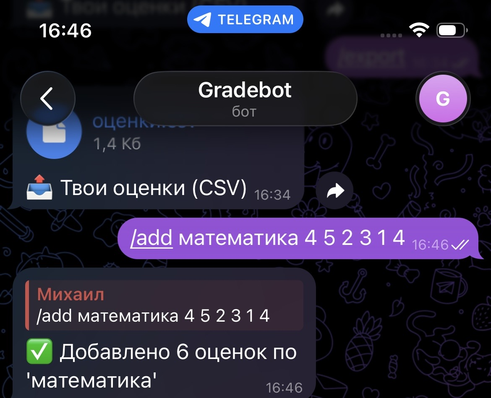
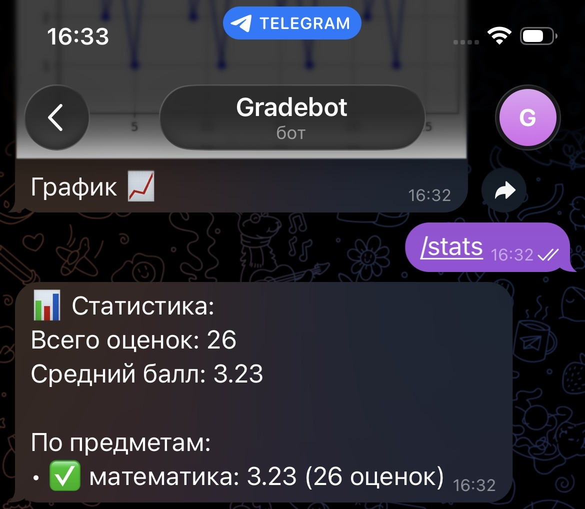
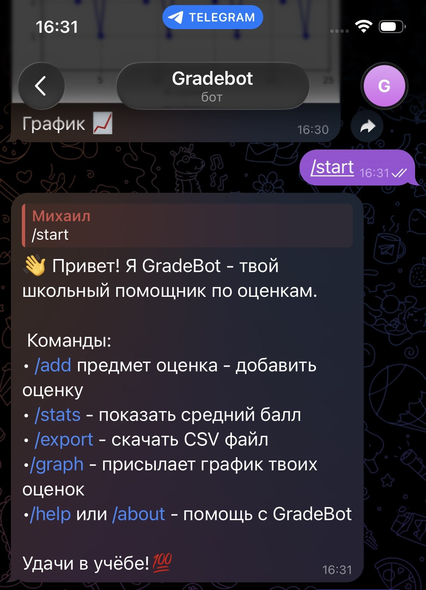
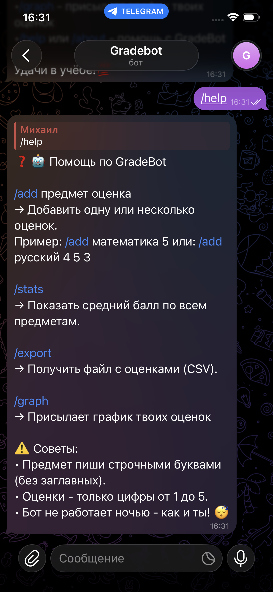
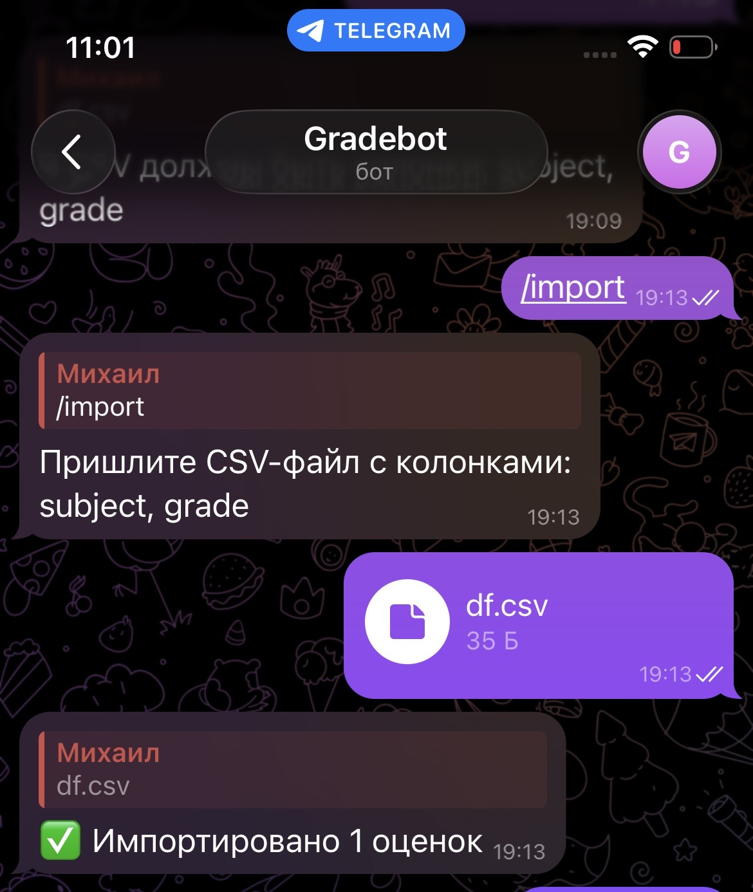

# 📊 GradeBot

A Telegram bot for tracking and analyzing school grades — built by a student, for students.

✨ *Turn your grades into insights. No magic — just data.*

## Features
- ✅ `/add subject grade` — log a new grade
- 📈 `/stats` — total count, average, per-subject stats
- 📊 `/graph` — monthly average & stability charts
- 🔍 `/insight` — smart analysis: best/worst day, growth trend, stable subjects
- 📤 `/import` — upload CSV (`subject, grade`) to bulk-import
- 🗓 `/today` — today’s grades

## 📸 Screenshots









## Tech Stack
- Python 3.8+
- `telebot` (pyTelegramBotAPI)
- `pandas` + `matplotlib` for analytics & viz
- SQLite for local storage

## Setup
1. Get a bot token from [@BotFather](https://t.me/BotFather)
2. Save it in `.env`:
```env
TELEGRAM_TOKEN=your_token_here
```
3. Install dependencies:
```bash
pip install telebot pandas matplotlib
```
4. Run:
```bash
python bot.py
```

> 💡 Tip: Delete `grades.db` before first run — it will be created automatically.

## Why?
Because learning should be measurable.
And because you deserve a tool that *works* — not just “hello world”.


Made with ❤️ by a 12-year-old engineer.
